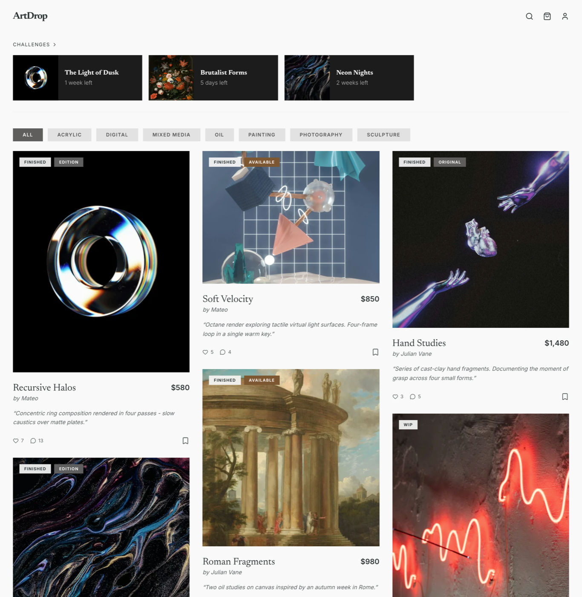
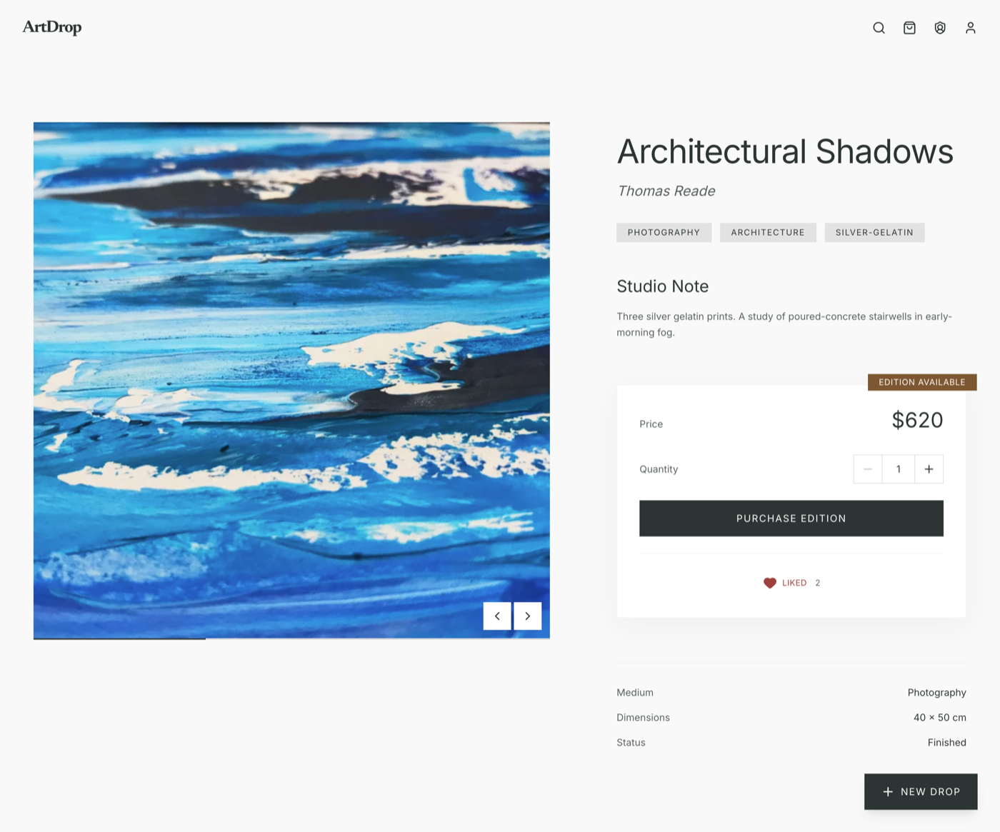
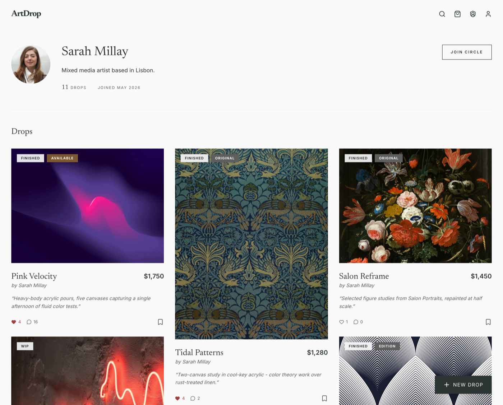
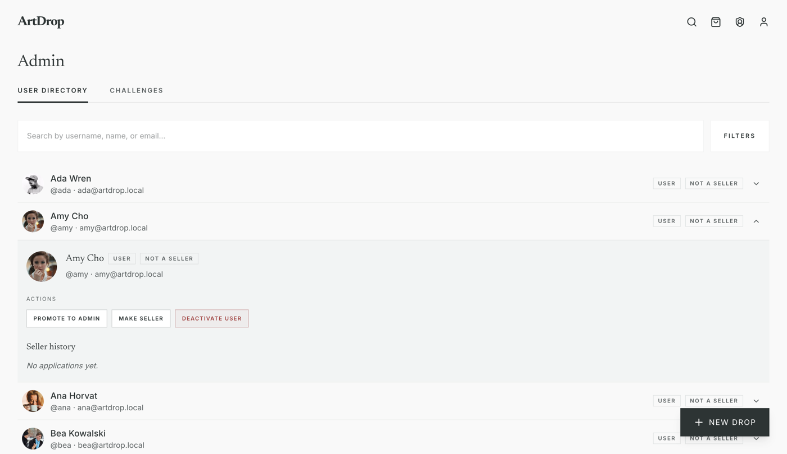
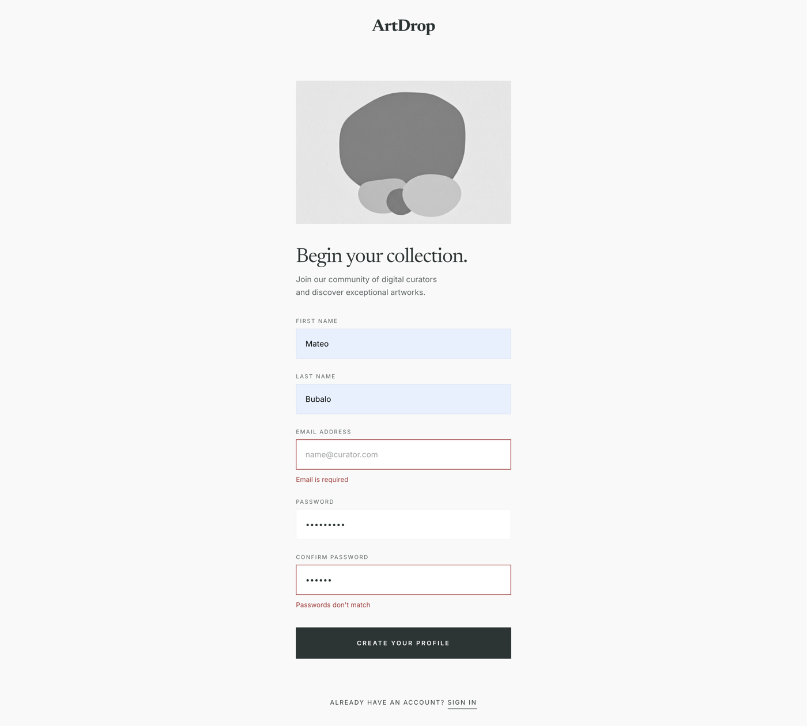

# ArtDrop (In Progress)

ArtDrop is my full-stack project for practicing real backend work with Java and Spring Boot, together with a React frontend.
I built it to get better at API design, authentication, data modeling, and shipping features end to end.

## Tech Stack
- Backend: Java 25, Spring Boot, Spring Security, Spring Data JPA, JWT, Maven, H2
- Frontend: React, TypeScript, Vite, Tailwind CSS, React Query
- Workflow: Git, REST API design, validation, role-based access control

## What It Can Do Right Now
- Authentication and authorization with JWT and roles
- Artwork feed and artwork details
- Comments, collections, and challenge flows
- Admin and seller-related management flows

## Run Locally
Backend:
```bash
cd ArtDrop
./mvnw spring-boot:run
```

Frontend:
```bash
cd artdropapp-frontend
npm install
npm run dev
```

## Screenshots
### Home


### Artwork Detail


### Profile


### Admin


### Sign Up


## What I Am Working On Next
- Increase automated test coverage with JUnit (service and controller layers)
- Improve UX across key flows (navigation clarity, feedback states, responsiveness)
- Implement order logic for purchase flow
- Integrate Stripe for checkout and payment confirmation

## Status
Development in progress. The core is already there, and I am now improving the UX, adding order logic, and integrating Stripe.
