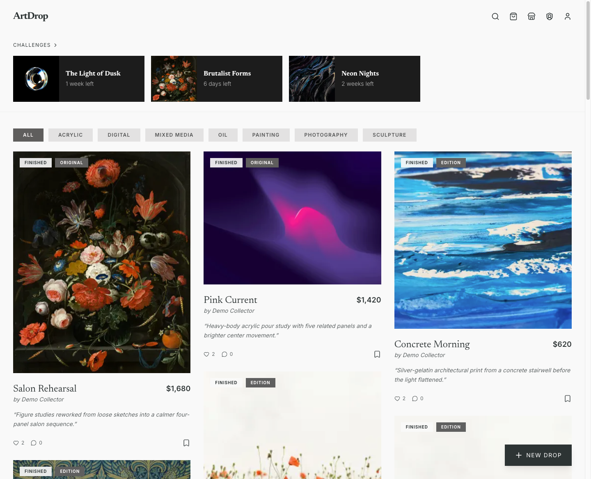
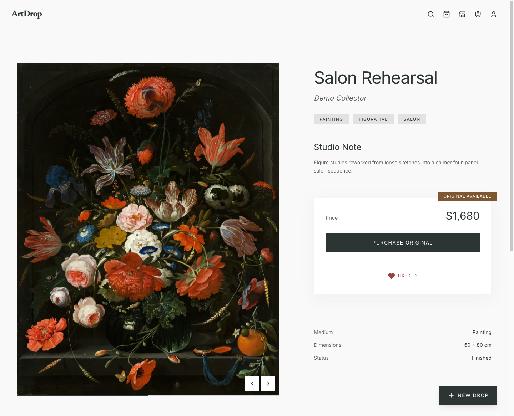
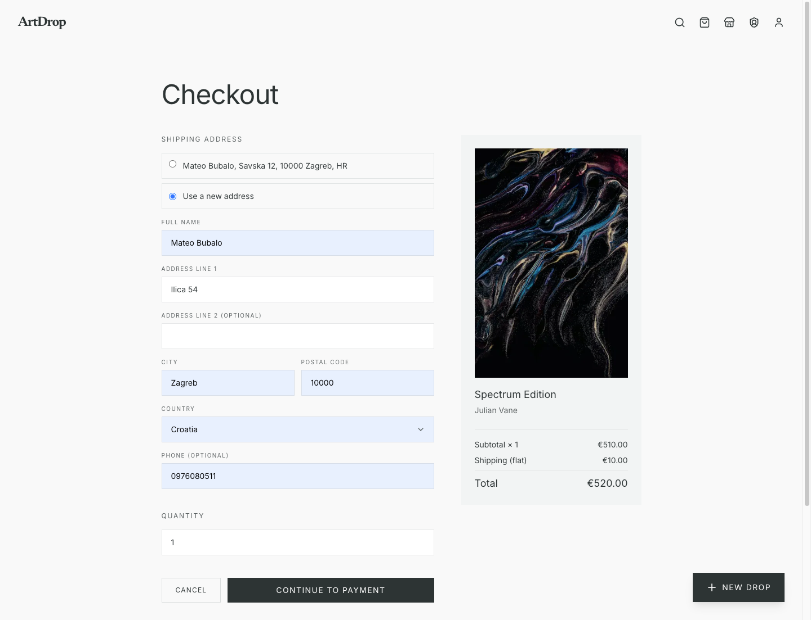
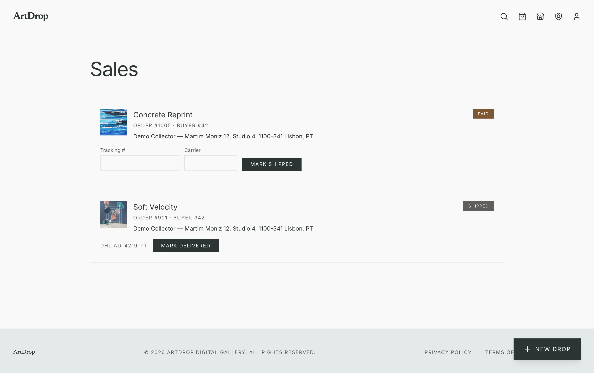
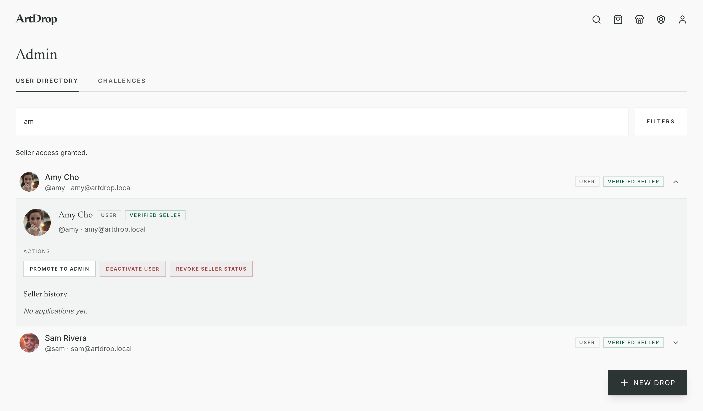

# [ArtDrop](https://art-drop.up.railway.app)

[](https://github.com/mateoo04/art-drop/actions/workflows/ci.yml)

**ArtDrop is a full-stack art marketplace** built as a portfolio project with a Spring Boot backend and a React frontend. It covers the main flows of a real marketplace: users can browse artwork, sell pieces, join challenges, purchase artwork, and manage orders.

The goal was to practice **end-to-end product development**: REST API design, authentication, role-based access, relational data modeling, checkout flows, admin tooling, and a polished frontend.

## Highlights

- **Authentication and roles** with JWT-based login, protected routes, demo login, user profiles, seller status, and admin access.
- **Artwork marketplace** with artwork drops, editing, detail pages, likes, comments, collections, search, and responsive feed layouts.
- **Orders and checkout** with shipping addresses, Stripe checkout session support, buyer order history, seller sales view, order status changes, and reservation conflict handling.
- **Challenge system** where artists can submit eligible artwork to active challenges.
- **Admin dashboard** for users, seller applications, role changes, account activation, challenge management, and featured challenge selection.
- **Production-style backend foundations**: PostgreSQL, Flyway migrations, Caffeine caching/rate limiting, validation, Testcontainers integration tests, and Docker-based local development.

## Tech Stack

**Backend:** Java 25, Spring Boot 4, Spring Security, Spring Data JPA, PostgreSQL, Flyway, Caffeine, Maven, Testcontainers, Stripe API  
**Frontend:** React 19, TypeScript, Vite, Tailwind CSS, React Router, React Query, i18next, Cloudinary uploads  
**Workflow:** REST APIs, role-based authorization, Docker, GitHub Actions CI

## Screenshots

### Home Feed



### Artwork Detail



### Checkout / Order Flow



### Orders and Sales



### Admin Dashboard



## Run Locally

Requirements: **Java 25**, **Node.js**, **Docker**, and **npm**.

1. Copy environment files:

```bash
cp .env.example .env
cp artdropapp-frontend/.env.example artdropapp-frontend/.env
```

Set `JWT_BASE64_SECRET` in `.env`:

```bash
openssl rand -base64 64 | tr -d '\n'
```

2. Start PostgreSQL:

```bash
docker compose up -d
```

3. Start the backend:

```bash
cd ArtDrop
SPRING_PROFILES_ACTIVE=dev ./mvnw spring-boot:run
```

4. Start the frontend:

```bash
cd artdropapp-frontend
npm install
npm run dev
```

The frontend runs on `http://localhost:5173`. The backend uses the local Postgres database from `docker-compose.yml`; Flyway applies migrations automatically, and the `dev` profile loads seed data.

## Useful Commands

```bash
cd ArtDrop && ./mvnw test
cd artdropapp-frontend && npm run build
cd artdropapp-frontend && npm run lint
```

Integration tests use **Testcontainers**. On macOS with Docker Desktop, set this first if Docker is not detected:

```bash
export DOCKER_HOST=unix://$HOME/.docker/run/docker.sock
```

## Status

Core marketplace, admin, challenge, checkout, and order flows are implemented. Ongoing work is focused on UX polish, broader test coverage, and deployment/demo hardening.
