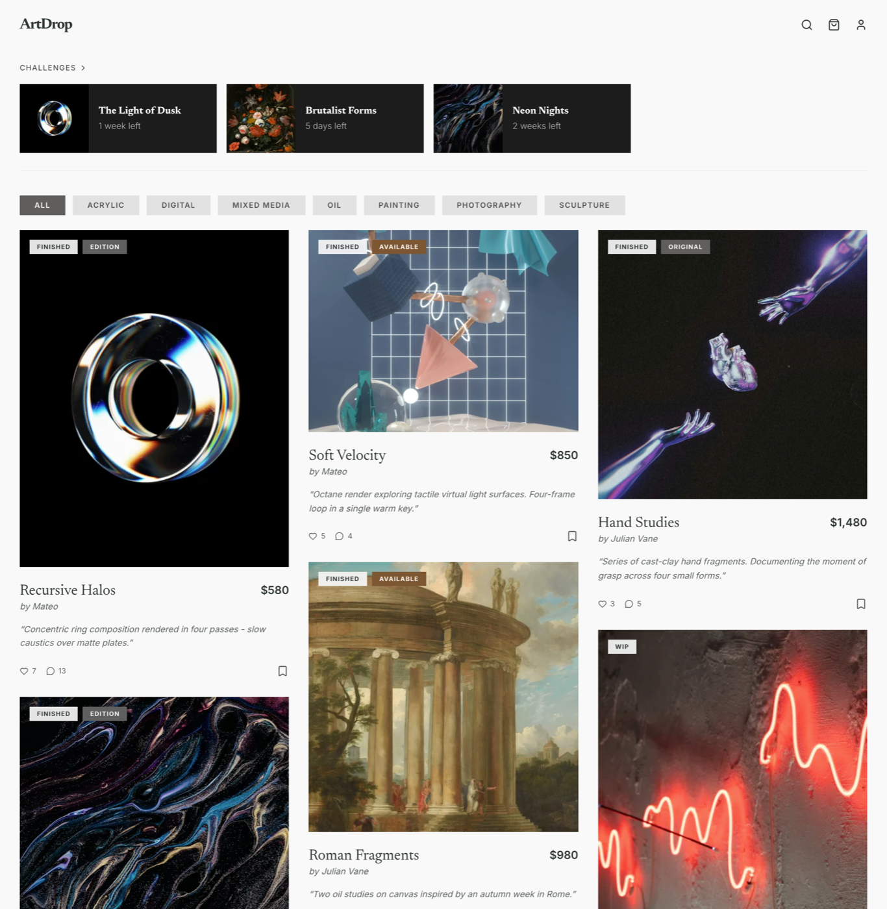
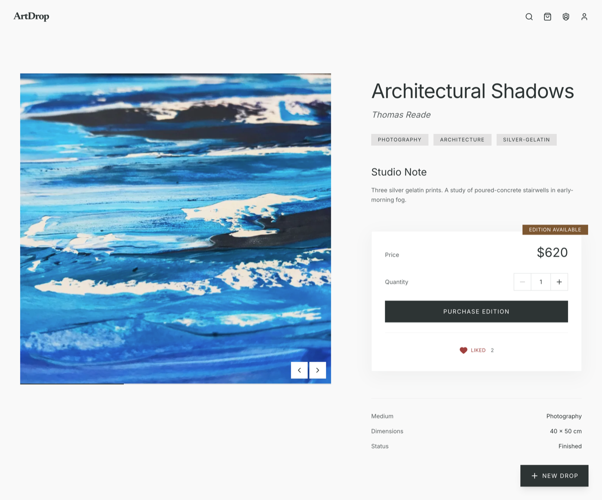
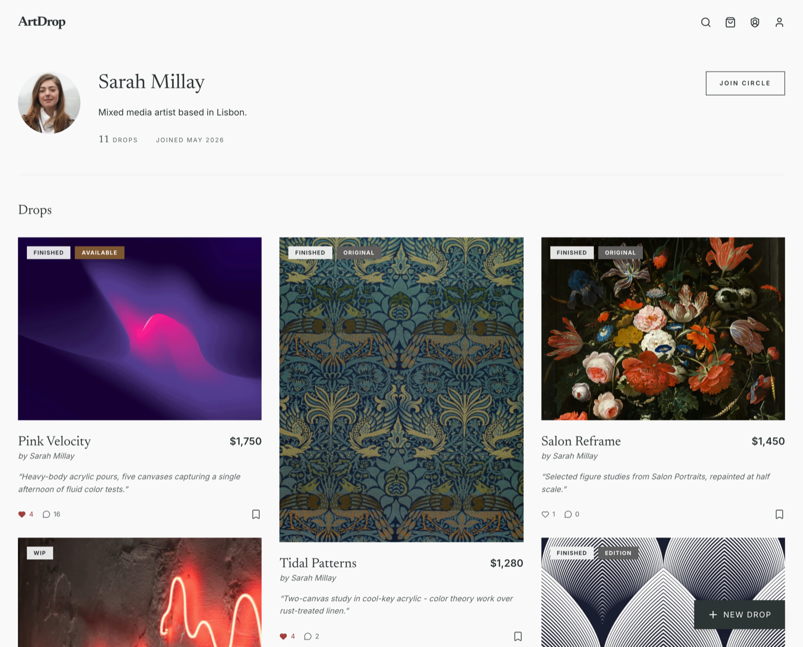
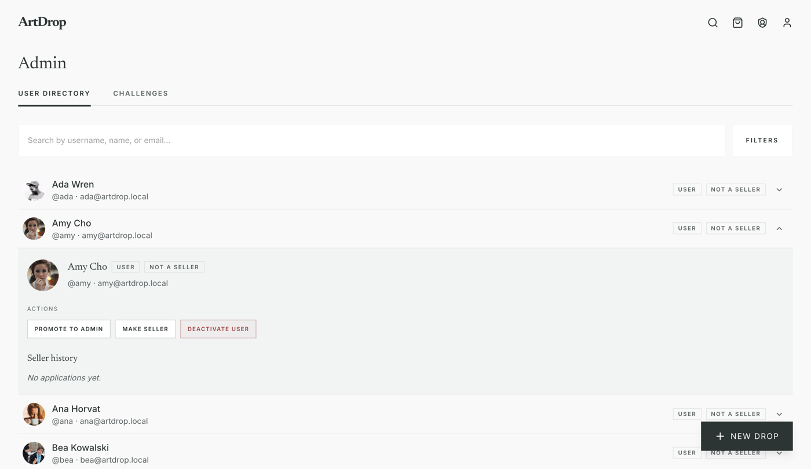
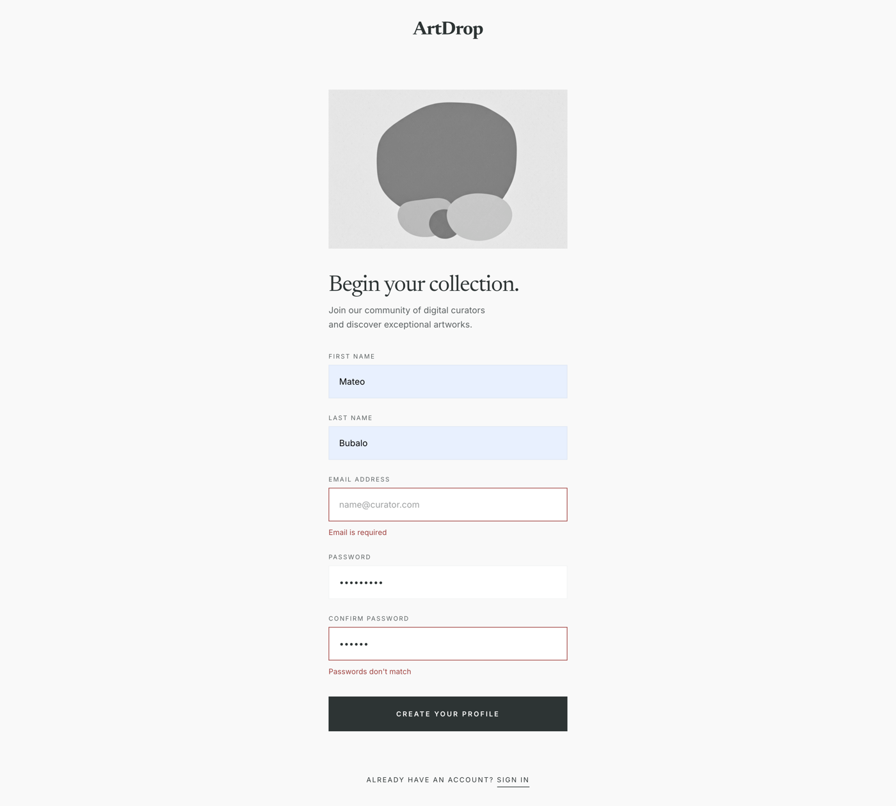

# ArtDrop (In Progress)

[](https://github.com/mateoo04/art-drop/actions/workflows/ci.yml)

ArtDrop is my full-stack project for practicing real backend work with Java and Spring Boot, together with a React frontend.
I built it to get better at API design, authentication, data modeling, and shipping features end to end.

## Tech Stack
- Backend: Java 25, Spring Boot, Spring Security, Spring Data JPA, JWT, Maven, PostgreSQL, Flyway
- Frontend: React, TypeScript, Vite, Tailwind CSS, React Query
- Workflow: Git, REST API design, validation, role-based access control, Docker for local Postgres

## What It Can Do Right Now
- Authentication and authorization with JWT and roles
- Artwork feed and artwork details
- Comments, collections, and challenge flows
- Admin and seller-related management flows

## Run Locally

1. Start Postgres in Docker (first time only — afterwards it just resumes):
```bash
cp .env.example .env   # then edit JWT_BASE64_SECRET
docker compose up -d
```

2. Backend (loads dev seed via Flyway when the `dev` profile is active):
```bash
cd ArtDrop
SPRING_PROFILES_ACTIVE=dev ./mvnw spring-boot:run
```

3. Frontend:
```bash
cd artdropapp-frontend
npm install
npm run dev
```

Migrations live in `ArtDrop/src/main/resources/db/migration/` (versioned `V1__`, `V2__`, …) and Flyway applies them on startup. The dev seed is `ArtDrop/src/main/resources/db/dev/R__seed.sql` and runs only under the `dev` profile.

### Tests

Integration tests use [Testcontainers](https://www.testcontainers.org/) to spin up a throwaway Postgres for each test run. On macOS with Docker Desktop, the JVM may not auto-detect the daemon socket — set `DOCKER_HOST` first:

```bash
export DOCKER_HOST=unix://$HOME/.docker/run/docker.sock
cd ArtDrop && ./mvnw test
```

## Screenshots
### Home


### Artwork Detail


### Profile


### Admin


### Sign Up


## What I Am Working On Next
- Increase automated test coverage with JUnit (service and controller layers)
- Improve UX across key flows (navigation clarity, feedback states, responsiveness)
- Implement order logic for purchase flow
- Integrate Stripe for checkout and payment confirmation

## Status
Development in progress. The core is already there, and I am now improving the UX, adding order logic, and integrating Stripe.
